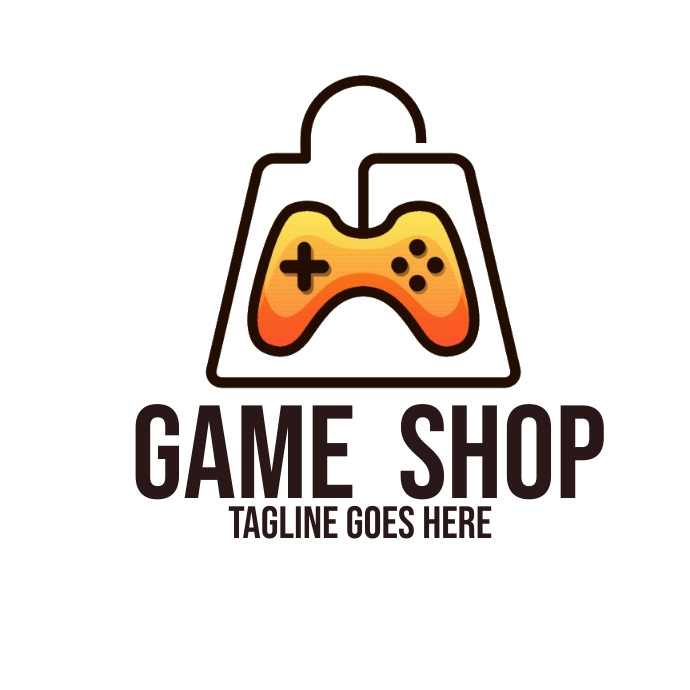

# Proops

  

  

  
  
  
   
   

# Proops Documentation
 o> Description
  Proops is an Project for managing a collection of Game, allowing users to buy, sell, and view details about their Game.This documentation provides details on the available endpoints and how to use them.

  

# Getting Started
 To get started with the Proops, follow these steps:

  

# Clone the repository.
 - Install dependencies using npm install(npm i).
 - Set up the database by running migrations with npm run migrate.
 - Start the server with npm start / nodemon in server.
 - Start the client with npm run dev.

o> Install them using `npm install`.

  

# Note
I'm really sorry for the project we made,Raps team it still can't support mobile due to time. Maybe the mobile version is still coming soon

Overview :
- CRUD
o Map

- Home Landing Page \*
- Membuat fitur login (pair programming)
- CRUD dari data Games \*
- Validasi notEmpty, notNull, isEmail, len (17 karakter) untuk password \*
- Handle errornya di route tersebut \*
- Helper untuk mendapatkan price ke IDR  \*

o. Database

- Add Migration  \*
- Model & migration \*
- Seed all data \*

o Database Name & Table Name

- Pair-Pro-Ops (db Name) \*
- Users, Games, Profiles, Categories, UserGames (Table Name) \*

o List of Package

- pg \*
- sequelize \*
- ejs \*
- express \*
  -sequelie-cli\*
  -bcrypt\*
  -nodemon \*

  